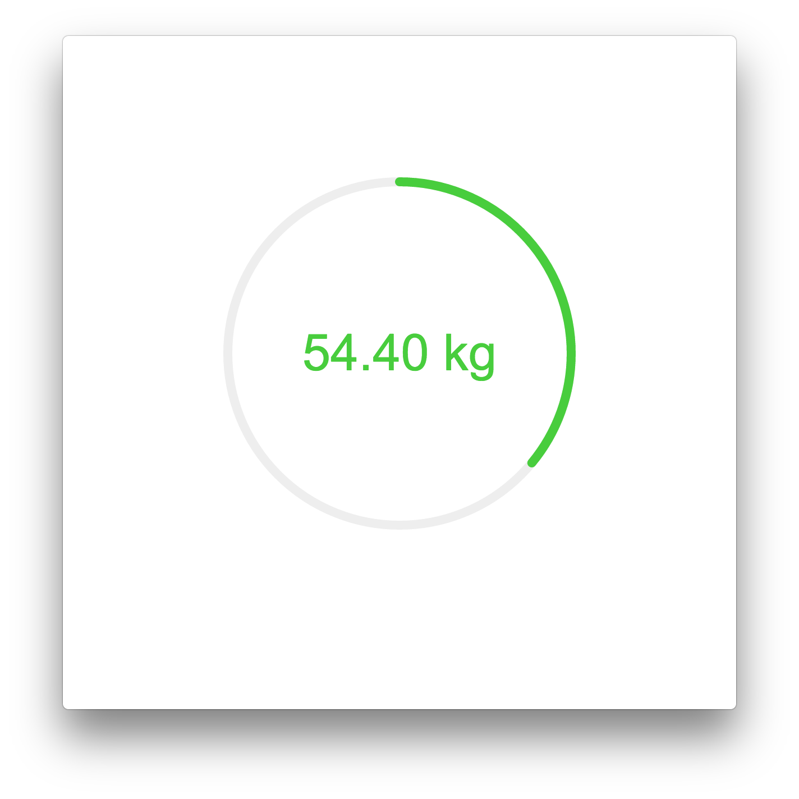
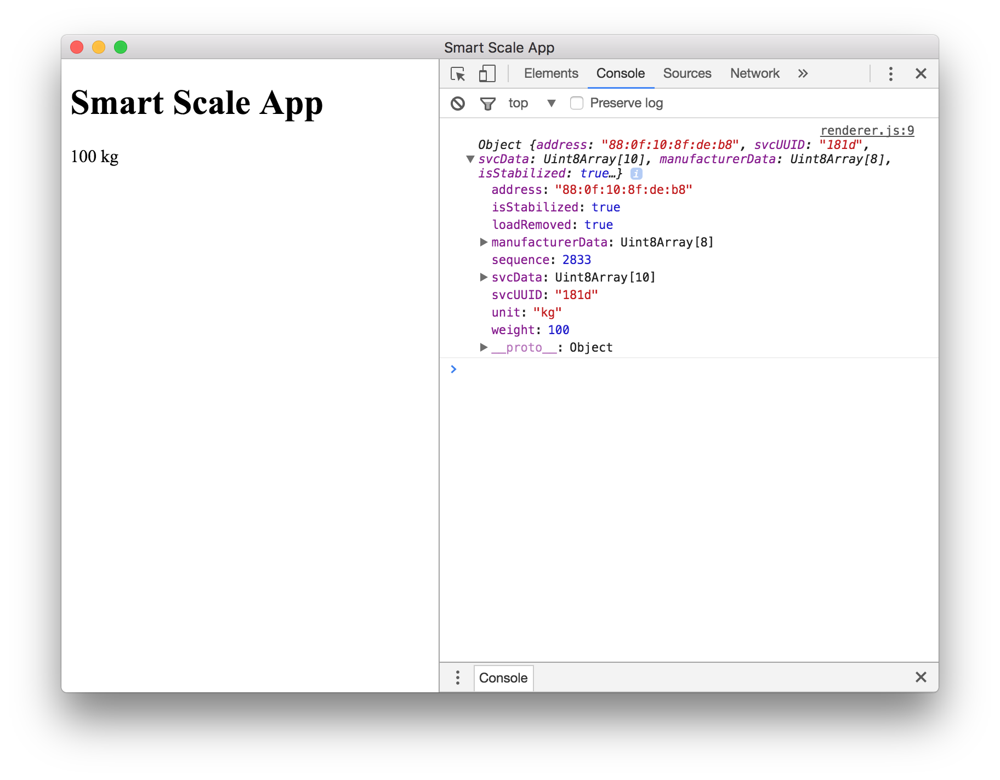
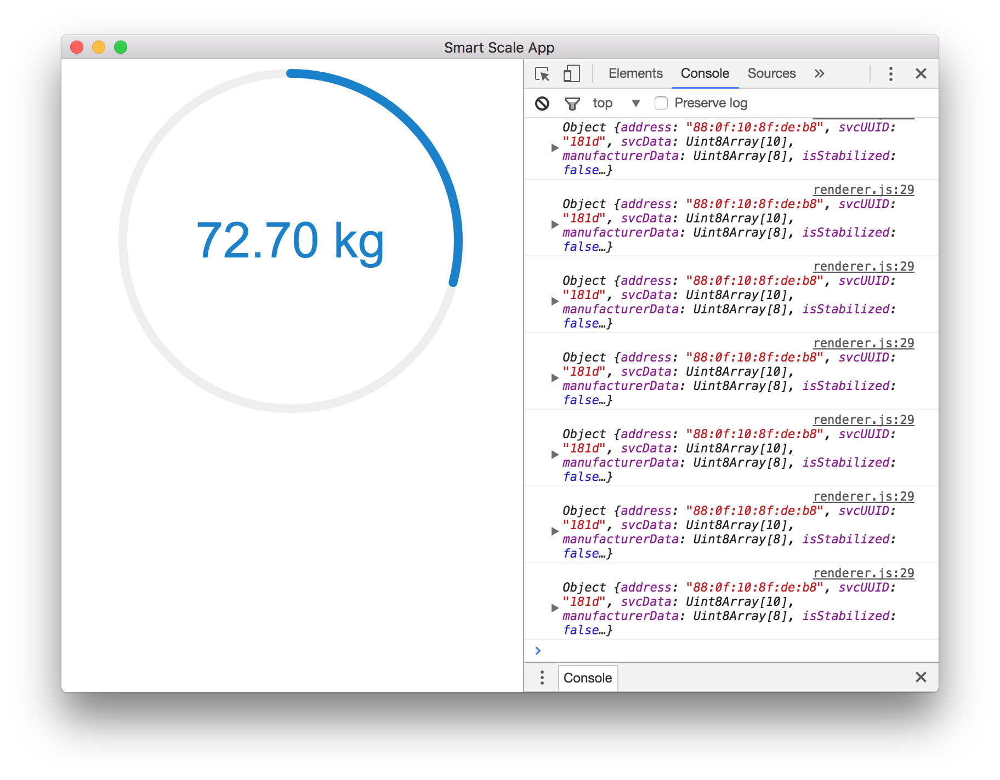

# Smart Scale App

Electron is new way to develop modern `Desktop` apps with all power of `NodeJS`,
`HTML`, and `CSS`. You can easily get things done within minutes, or hours for
simple apps, and that will be nice enough to solve 80% of your day to day needs.



In this example we are going to explore `Electron` universe by creating a simple
app that will help us to get access to `IoT` world. There are bunch of smart
devices such as `fitness trackers`, `Smart Scale`, `Remove controlled light
bulbs` all of them good, and make your life ease.

But some times user experience is not so good, and you need a bit more. Or you
just need access to the raw data. However setup a full stack project an overkill
for this. That when `Electron` go into play.

Today we are going to build a super simple app that will show you your weight in
real time collecting data from your `Smart Scale` and presenting it in a nice
format.

First of all we should setup things properly. There is bunch of boilerplates but
we gonna keep things simple.

```sh
# Clone this repository
git clone https://github.com/electron/electron-quick-start
# Go into the repository
cd electron-quick-start
# Install dependencies
npm install
# Run the app
npm start
```

You will have something like this

```sh
.
├── README.md
├── index.html
├── main.js
├── node_modules
├── package.json
└── renderer.js
```

* `index.html` - Is main view of your app
* `main.js` - Is entry point to your app
* `renderer.js` - Is renderer process where all `NodeJS` staff is available.

So in order to build our app we need to split it into 3 part:

* - GUI and UX
* - data service

`Smart scale` is build on BLE, (Bluetooth Low Energy) is very nice protocol, in
`npm` land we have https://github.com/sandeepmistry/noble project that provide
us low level API for basic bluetooth interaction.

But we can go even further, quick search on github will give us ready to use
`npm` package for `Smart Scale` https://github.com/perillamint/node-xiaomi-scale


```sh
% npm i node-xiaomi-scale --save
```

If you have problems with building this native extensions you can check [this](https://github.com/opensprints/opensprints-electron/issues/5) discussion.

Now we are ready to start getting our firs real data in the app.

Our UI is going to be pretty simple

```html
<!DOCTYPE html>
<html>
  <head>
    <meta charset="UTF-8">
    <title>Smart Scale App</title>
  </head>
  <body>
    <h1>Smart Scale App</h1>
    <div id="weight">No Data</div>
  </body>
  <script>
    require('./renderer.js')
  </script>
</html>
```

As well as our data layer, just get sample code from `node-xiaomi-scale` package
and put it  into `renderer.js` file and we good to go, our `MVP` is ready :)


```js
const MiScale = require('node-xiaomi-scale');

let miscale = new MiScale();

miscale.startScanning();

miscale.on('data', function (scale) {
  console.log(scale);
});
```

start you app by

```sh
$ npm start
```



Now we just need to polish our app and build it for all available platforms.

For nice UI we are going to use http://ignitersworld.com/lab/radialIndicator.html

```sh
$ wget https://raw.githubusercontent.com/s-yadav/radialIndicator/master/radialIndicator.min.js
```

UI

```html
<!DOCTYPE html>
<html>
  <head>
    <meta charset="UTF-8">
    <title>Smart Scale App</title>
    <style>
      #container {
        display: flex;
        align-items: center;
        justify-content: center;
      }
    </style>
  </head>
  <body>
    <div id="container">
      <div id="weight"></div>
    </div>
  </body>
  <script>
    require('./renderer.js')
  </script>
</html>
```

Data layer

```js
const radialIndicator = require('./radialIndicator.min.js')
const MiScale = require('node-xiaomi-scale');
const miscale = new MiScale();

miscale.startScanning();

const radialObj = radialIndicator('#weight' , {
  radius: 150,
  minValue: 0,
  fontWeight: 'normal',
  roundCorner: true,
  barWidth: 8,
  maxValue: 250,
  barColor: {
    200: '#FF0000',
    100: '#FFFF00',
    80: '#0066FF',
    50: '#33CC33',
  },
  format: function (value) {
    return `${value.toFixed(2)} kg`;
  },
});

miscale.on('data', function (scale) {
  radialObj.animate(scale.weight)
  console.log(scale);
});
```

So our app is pretty mach ready.



Build you app

```sh
$ npm i electron-builder --save-dev
```

add some sections to your package.json

```json
{
  ...
  "scripts": {
    "start": "electron .",
    "pack": "build --dir",
    "dist": "build"
  },
  "build": {
    "appId": "smart.scale.app",
    "mac": {
      "category": "smart.scale.app.ble"
    }
  },
  ....
}
```

run

```sh
$ npm run dist
```
